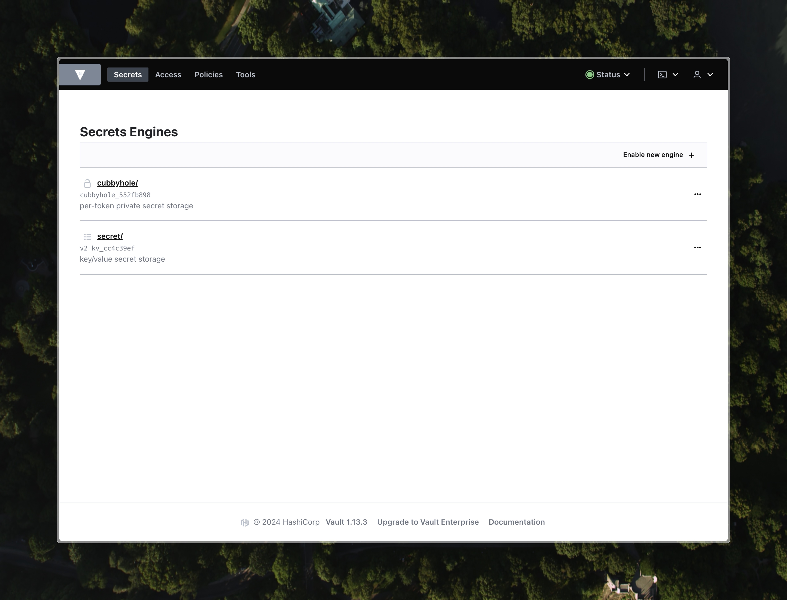
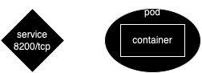

University: [ITMO University](https://itmo.ru/ru/)
Faculty: [FICT](https://fict.itmo.ru)
Course: [Introduction to distributed technologies](https://github.com/itmo-ict-faculty/introduction-to-distributed-technologies)
Year: 2023/2024
Group: K4110c
Author: Kazakov Stepan Vladislavovich
Lab: Lab1
Date of create: 04.04.2024
Date of finished: 

## Предварительне настройки
- В качестве кластера вместо minikube используется реальный кластер Managed Service for Kubernetes от Я.Облака.
- Kubeconfig кластера добавлен через утилиту [yc](https://yandex.cloud/ru/docs/cli/quickstart)
- kubecontex заранее установлен для нужного кластера в namespace `lab1`

## Запуск Vault
```bash
kubectl create ns lab1
kubectl apply -f manifests
kubectl logs vault
```
В результате инициализации Vault создается 5 ключей восстановления и root токен (production). Так как vault запущен в режиме разработки, предоставляется всего 1 ключ восстановления. Ключи и root токен выводятся в консоль.
```
WARNING! dev mode is enabled! In this mode, Vault runs entirely in-memory
and starts unsealed with a single unseal key. The root token is already
authenticated to the CLI, so you can immediately begin using Vault.

You may need to set the following environment variables:

    $ export VAULT_ADDR='http://0.0.0.0:8200'

The unseal key and root token are displayed below in case you want to
seal/unseal the Vault or re-authenticate.

Unseal Key: ************
Root Token: hvs.***************

Development mode should NOT be used in production installations!
```

## Проброс портов на локальный ПК
```bash
kubectl port-forward service/vault 8200:8200
```
Результат
```                                                                            
Forwarding from 127.0.0.1:8200 -> 8200
Forwarding from [::1]:8200 -> 8200
...
Handling connection for 8200
```

## Результат


