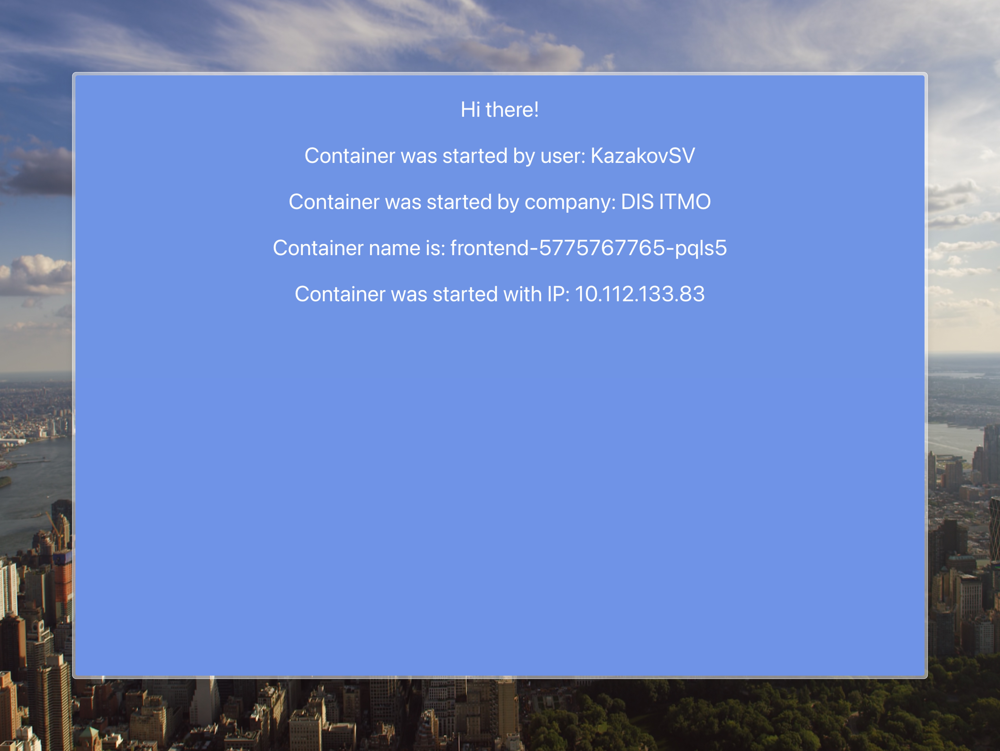
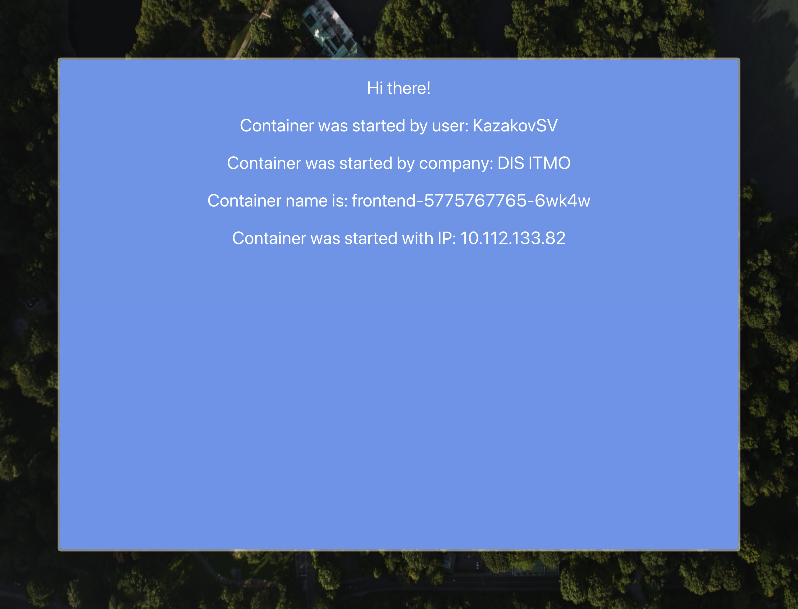
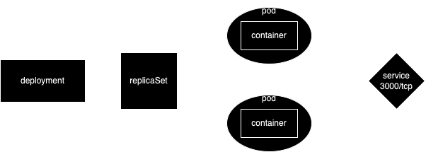
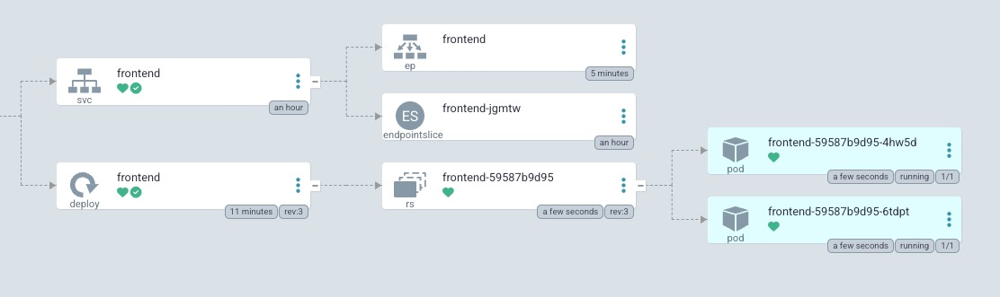

University: [ITMO University](https://itmo.ru/ru/)
Faculty: [FICT](https://fict.itmo.ru)
Course: [Introduction to distributed technologies](https://github.com/itmo-ict-faculty/introduction-to-distributed-technologies)
Year: 2023/2024
Group: K4110c
Author: Kazakov Stepan Vladislavovich
Lab: Lab2
Date of create: 04.04.2024
Date of finished: 

## Предварительне настройки
- В качестве кластера вместо minikube используется реальный кластер Managed Service for Kubernetes от Я.Облака.
- Kubeconfig кластера добавлен через утилиту [yc](https://yandex.cloud/ru/docs/cli/quickstart)
- kubecontex заранее установлен для нужного кластера в namespace `lab2`

## Запуск deployment
```bash
kubectl create ns lab2
kubectl apply -f mainfests
kubectl logs frontend
```
Результат
```
Builing frontend
Browserslist: caniuse-lite is outdated. Please run:
  npx update-browserslist-db@latest
  Why you should do it regularly: https://github.com/browserslist/update-db#readme
Browserslist: caniuse-lite is outdated. Please run:
  npx update-browserslist-db@latest
  Why you should do it regularly: https://github.com/browserslist/update-db#readme
build finished
Server started on port 3000
```
## Проборс портов на локальный ПК
```bash
kubectl port-forward service/frontend 3000:3000
```
Результат
```                                                                            
Forwarding from 127.0.0.1:3000 -> 3000
Forwarding from [::1]:3000 -> 3000
...
Handling connection for 3000
```

## Результат




Диаграмма:


### Полная диаграмма (из ArgoCD)


Фактически, объект `Service` создаёт ещё 2 объекта: `Enpoints`, который указывает на IP-адреса подов (конечные точки подключения для траффика) и `EndpointSlice` - фактически набор (срез) конечных точек.

При обновлении страницы занчения могут отличаться, так как приложение запущено в 2 копии, и сервис равномерно распределяет запросы между ними.

## Замечания

- При старте контейнеры потребляют достаточное количество ресурсов, видимо, по причине сборки приложения внутри контейнера. Возможно, стоит использовать другой механизм пропроски переменных в ReactApp или использовать server side rendering.
- docker образ основан на образе ноды 14.*, который в 2023/2024 является как минимум устаревшим. Стоит использовать более актуальные версии образов.