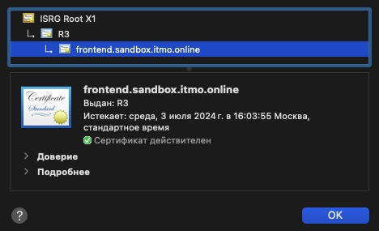
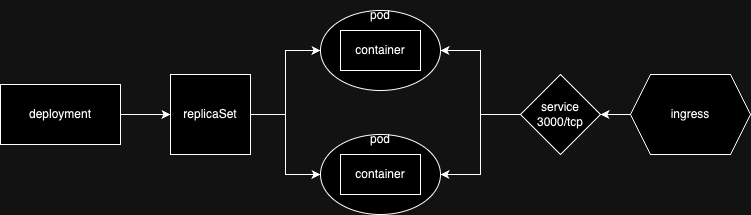
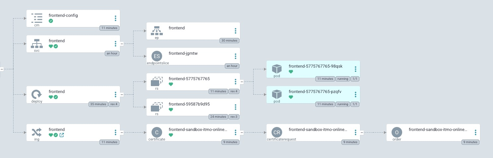

University: [ITMO University](https://itmo.ru/ru/)
Faculty: [FICT](https://fict.itmo.ru)
Course: [Introduction to distributed technologies](https://github.com/itmo-ict-faculty/introduction-to-distributed-technologies)
Year: 2023/2024
Group: K4110c
Author: Kazakov Stepan Vladislavovich
Lab: lab3
Date of create: 04.04.2024
Date of finished: 

## Предварительне настройки
- В качестве кластера вместо minikube используется реальный кластер Managed Service for Kubernetes от Я.Облака.
- Kubeconfig кластера добавлен через утилиту [yc](https://yandex.cloud/ru/docs/cli/quickstart)
- kubecontex заранее установлен для нужного кластера в namespace `lab3`
- в кластере уже установлены `cert-manager` и `ingress-nginx`, поэтому будет сгенерирован сертификат для домена [`frontend.sandbox.itmo.online`](https://frontend.sandbox.itmo.online)
- в манифестах присутсвует объект [`issuer`](mainfests/issuer.yaml) для автоматической генерации сертификата LetsEncrypt

## Запуск deployment
```bash
kubectl create ns lab3
kubectl apply -f mainfests
kubectl logs frontend
```
Результат
```
Builing frontend
Browserslist: caniuse-lite is outdated. Please run:
  npx update-browserslist-db@latest
  Why you should do it regularly: https://github.com/browserslist/update-db#readme
Browserslist: caniuse-lite is outdated. Please run:
  npx update-browserslist-db@latest
  Why you should do it regularly: https://github.com/browserslist/update-db#readme
build finished
Server started on port 3000
```

## Результат


### Принципиальная диаграмма:


### Полная диаграмма (из ArgoCD)


При обновлении страницы занчения могут отличаться, так как приложение запущено в 2 копии, и сервис равномерно распределяет запросы между ними.
