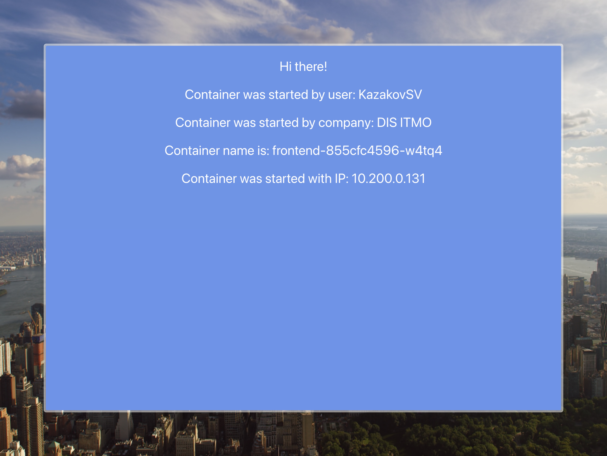
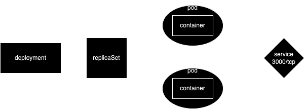

University: [ITMO University](https://itmo.ru/ru/)
Faculty: [FICT](https://fict.itmo.ru)
Course: [Introduction to distributed technologies](https://github.com/itmo-ict-faculty/introduction-to-distributed-technologies)
Year: 2023/2024
Group: K4110c
Author: Kazakov Stepan Vladislavovich
Lab: Lab2
Date of create: 04.04.2024
Date of finished: 

## Предварительне настройки
- kubecontex заранее установлен для нужного кластера в namespace `lab4`
- оригинальный образ предназначен только для платформы `amd64` и не может быть запущен на `arm64`. пришлось пересобрать образ для использования на `arm64` ([Dockerfile](Dockerfile)):
```
docker build -t ksrt12/itdt-contained-frontend:node16 . --push
```

## Запуск и конфигурация minikube
```bash
minikube start --network-plugin=cni --cni=calico --nodes 2 -p itmo
kubectl label nodes itmo zone=kronva
kubectl label nodes itmo-m02 zone=lomo
```
Результат
```bash
kubectl get nodes -o custom-columns='NAME:.metadata.name,ZONE:.metadata.labels.zone'
NAME       ZONE
itmo       kronva
itmo-m02   lomo
```

## Запуск deployment
```bash
kubectl create ns lab4
kubectl patch ippool default-ipv4-ippool --type='merge' -p '{"spec":{"disabled":true}}' # disable default ipv4 pool
kubectl apply -f mainfests
```
Результат
```bash
kubectl get pods -l app=frontend -o wide
NAME                        READY   STATUS    RESTARTS   AGE   IP             NODE       NOMINATED NODE   READINESS GATES
frontend-855cfc4596-dv6t2   1/1     Running   0          11m   10.200.1.66    itmo       <none>           <none>
frontend-855cfc4596-w4tq4   1/1     Running   0          11m   10.200.0.131   itmo-m02   <none>           <none>
```
IP-адреса запущенных подов находся в заданных ранее пулах

## Пинг соседнего пода
```bash
ping frontend-855cfc4596-dv6t2
ping: frontend-855cfc4596-dv6t2: Name or service not known
```
Вероятно, это связано с тем, что coredns не знает о новых подсетях, в которых созданы поды

## Проборс портов на локальный ПК
```bash
kubectl port-forward service/frontend 3000:3000
```
Результат
```                                                                            
Forwarding from 127.0.0.1:3000 -> 3000
Forwarding from [::1]:3000 -> 3000
...
Handling connection for 3000
```

## Результат



Диаграмма:

